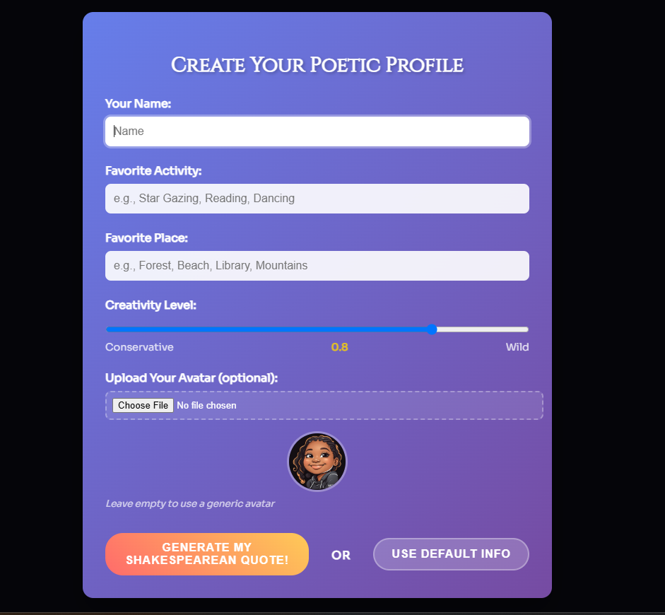
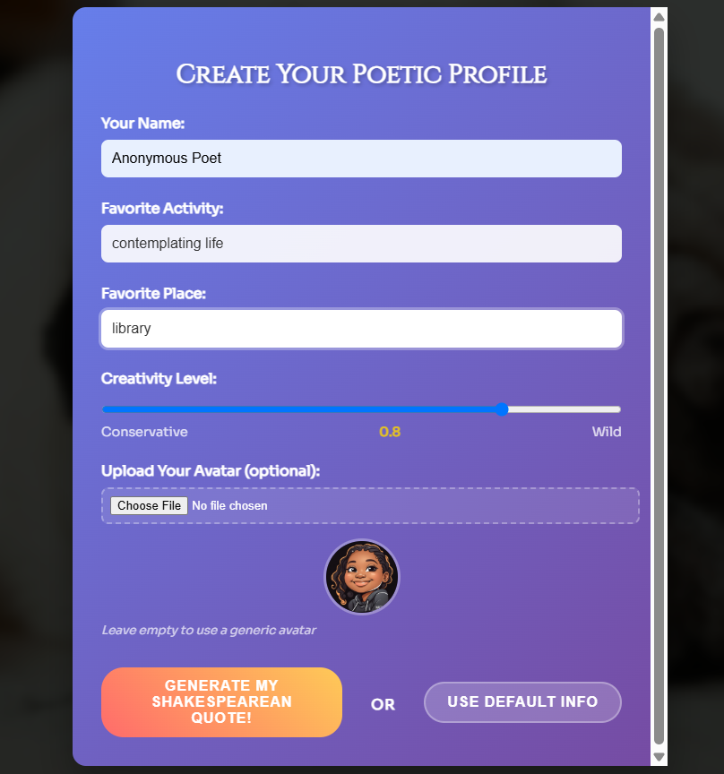
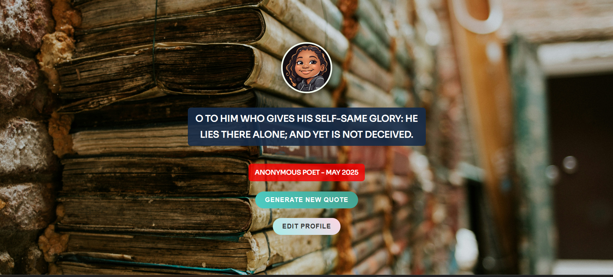

# 🎭 Shakespearean Poetry Generator

Unleash the Bard within your browser. This locally powered app lets you create Shakespeare-style verses based on your favorite activity and place — with no API keys and no rate limits.

---

## ✨ Features

* 🧠 **Local Shakespeare Model** – Built on `striki-ai/william-shakespeare-poetry` via Hugging Face Transformers
* ⚡ **FastAPI Backend** – Async-ready, self-documented, and fast
* 🖼️ **Scenic Backgrounds** – Dynamic Unsplash integration for visual flair
* 🖋️ **Poetic Prompts** – Personalized verse with Elizabethan elegance
* 🎛️ **Creativity Controls** – Adjust temperature and length to fine-tune your poetic muse
* 🧩 **Graceful Fallbacks** – When the AI stumbles, curated backups fill the void
* 🎨 **Vanilla Frontend** – Responsive, stylish, and minimal

---

## 📸 Demo

> 🖼️ **Screenshots:**

| Config Modal                                | User Prompt                              |
| ------------------------------------------- | ---------------------------------------- |
|  |  |



---

## 🗂️ Project Structure

```
shakespeare-poetry-generator/
├── backend/               # FastAPI app
│   ├── main.py            # Poetry model & API endpoints
│   ├── requirements.txt   # Backend dependencies
│   └── README.md
├── frontend/              # Vanilla JS frontend
│   ├── index.html
│   ├── index.css
│   ├── index.js
│   ├── utils.js
│   ├── avatar.png
│   └── loading.gif
├── .gitignore
├── README.md              # This file
```

---

## 🚀 Getting Started

### 🔧 Backend Setup

```bash
python -m venv venv
source venv/bin/activate        # Or venv\Scripts\activate on Windows
pip install -r backend/requirements.txt
cd backend
uvicorn main:app --reload
```

Backend runs at [http://localhost:8000](http://localhost:8000)

---

### 🖼️ Frontend Setup

```bash
cd frontend
python -m http.server 3000
```

Open your browser at [http://localhost:3000](http://localhost:3000)

---

## 🔌 API Overview

| Endpoint         | Method | Description                          |
| ---------------- | ------ | ------------------------------------ |
| `/`              | GET    | Basic API info                       |
| `/health`        | GET    | Model + system readiness check       |
| `/generate-poem` | POST   | Generate a custom Shakespearean poem |

**Example Request:**

```json
{
  "activity": "star gazing",
  "place": "forest",
  "temperature": 0.8,
  "max_length": 100
}
```

---

## ⚙️ .gitignore

```gitignore
# Python
__pycache__/
*.py[cod]
venv/
.env

# Frontend
node_modules/
*.log
.DS_Store

# IDEs
.vscode/
.idea/
```

---

## 🧠 Under the Hood

* **Model**: `striki-ai/william-shakespeare-poetry`
* **Backend**: FastAPI + PyTorch + Transformers
* **Frontend**: Plain JS, CSS, and HTML
* **Extras**: Unsplash API for scenic images, keyboard shortcuts for quick nav, and soft animations for a smooth experience

---

## 💬 Final Thoughts

Whether you're a dev with a poetic streak or a poet dabbling in code, this tool invites you to co-author with a digital Shakespeare. No external APIs. No fees. Just timeless verse, rendered on demand.

> *“Seek ye no key, nor empty out thy purse — Here dwells a Bard to spin eternal verse.”*

Happy generating! ✨📜

---